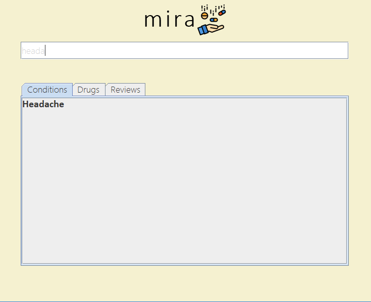
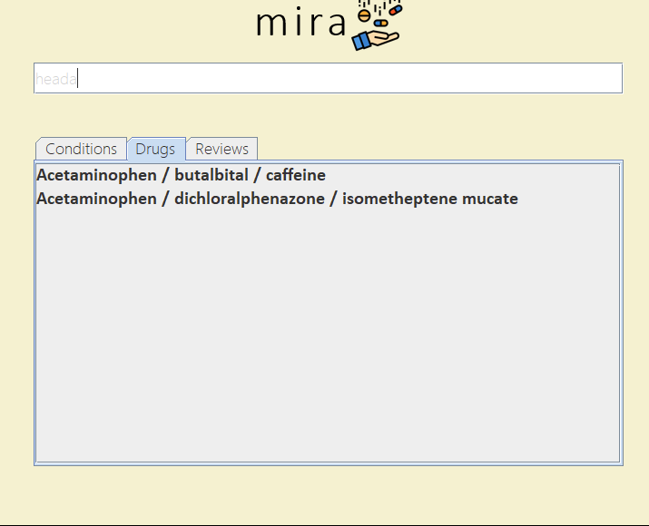
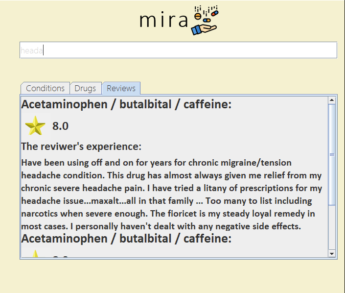

# medicine-review-application
---

This application is used to find reviews of medications that physicians and patients can use in order to gain more insight regarding what they recommend and use, respectively. This repository contains the java project files for the app. The app uses a python server to complement the java front-end. The data set was taken from Kaggle. Check the `dataset` and `api` folder for more instructions on the downloading process for the dataset and the setup for the back-end server.

### How it Works
The user enters in their medical condition or medication into the search bar. It is noteworthy that the software has an autocomplete feature using Trie. The user then selects their condition and the drug they are searching for. The program outputs a list of reviews a long with scores that each review gives the medicication. An example of this process is shown in the following set of pictures.

